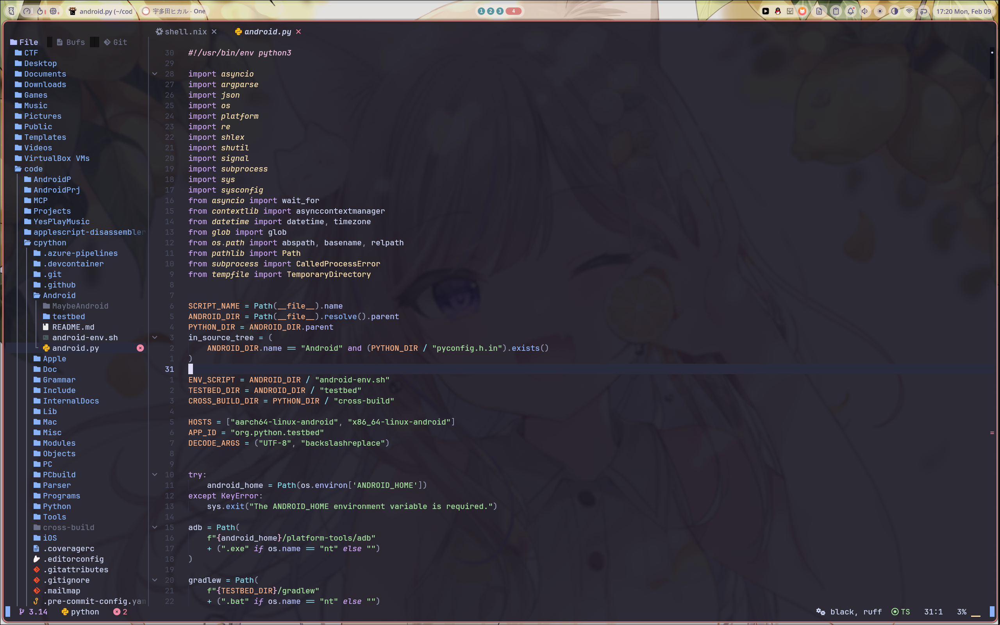
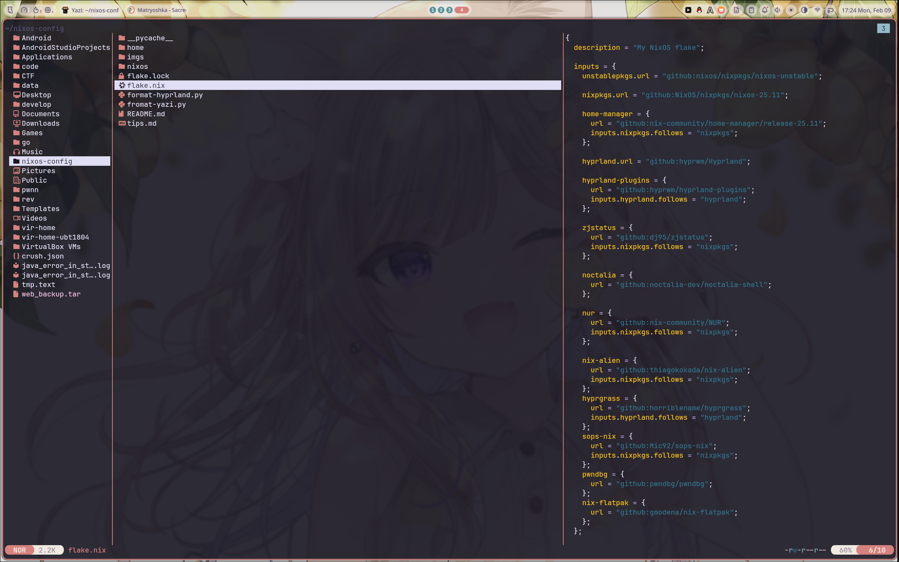

# Nixos-config

本人使用的 NixOS 配置，用于项目开发、网络安全研究，同时兼具日常使用。

## 系统组件

| 组件           | 名称                      |
| -------------- | ------------------------- |
| 窗口管理器     | Hyprland                  |
| 桌面环境       | Noctalia shell            |
| 终端           | Kitty + fish + starship   |
| 文本编辑器     | Neovim & vscode           |
| 颜色主题       | Rose Pine(Noctalia shell) |
| 字体           | Noto-fonts                |
| 本地媒体播放器 | mpv                       |
| 文件管理器     | yazi & dolphin            |
| 图片预览/编辑  | gradia & gimp             |
| 输入法         | Fcitx5 + rime             |
| 截屏 / 录屏    | hyprshot / obs            |
| 加密           | sops                      |
| 网络管理器     | NetworkManager            |
| 系统启动器     | systemd                   |

------

## 注意事项

- 这是偏个人化的配置，仅供参考与学习。
- 配置里依赖了个人文件与路径，无法保证在他人环境中直接可用。
- 项目处于逐步完善阶段，可能存在些许问题。
- 如果你对 Nix/NixOS 还不熟悉，建议先通读[官方文档](https://nix.dev/)。

## 问题与解决方式

更多命令与经验记录见 `tips.md`。


## 目录结构总览
- [NixOS 模块说明](nixos/modules/README.md)
- [Home Manager 模块说明](home/modules/README.md)

```
./
├── flake.lock                     # Flake 锁文件
├── flake.nix                      # Flake 入口与依赖定义
├── format-hyprland.py             # Hyprland 配置辅助格式化脚本
├── fromat-yazi.py                 # Yazi 相关格式化脚本
├── LICENSE                        # 开源许可证
├── README.md                      # 项目说明
├── tips.md                        # 使用/维护小贴士
├── home/                          # Home Manager 配置
│   ├── home.nix                   # Home Manager 主入口
│   └── modules/                   # Home Manager 模块集合
│       ├── cursor.nix             # 鼠标指针与 DPI/Xresources 配置
│       ├── fish.nix               # fish 配置
│       ├── gtk.nix                # GTK 主题/外观
│       ├── ssh.nix                # SSH 客户端配置
│       ├── vscode.nix             # VS Code 配置
│       ├── xdg.nix                # XDG 相关目录与配置
│       ├── yazi.nix               # Yazi 文件管理器配置
│       ├── zellij.nix             # Zellij 终端复用器配置
│       ├── AI/                    # AI 工具相关模块
│       │   ├── default.nix        # AI 模块入口
│       │   └── packages.nix       # AI 相关包列表
│       ├── Applications/          # 应用与工具集合
│       │   ├── default.nix        # 应用模块入口
│       │   ├── ida.nix            # IDA 相关配置
│       │   ├── tabby.nix          # Tabby 终端打包配置
│       │   ├── yesplaymusic.nix   # YesPlayMusic 配置
│       │   └── securityTools/     # 安全工具集合
│       │       ├── default.nix    # 安全工具入口
│       │       └── packages.nix   # 安全工具包列表
│       ├── dev/                   # 开发环境配置
│       │   ├── android.nix        # Android 开发相关
│       │   ├── default.nix        # 开发模块入口
│       │   ├── packages.nix       # 开发包列表
│       │   └── python.nix         # Python 开发环境
│       ├── hyprland/              # Hyprland 桌面环境
│       │   ├── default.nix        # Hyprland 模块入口
│       │   ├── hyprland.nix       # Hyprland 主配置
│       │   └── conf/              # Hyprland 细分配置
│       │       ├── exec.nix       # 启动项
│       │       ├── keybindings.nix# 快捷键
│       │       ├── noctalic-theme.nix # 主题
│       │       └── settings.nix   # 基础设置
│       ├── kitty/                 # Kitty 终端配置
│       │   └── default.nix        # Kitty 模块入口
│       ├── neovim/                # Neovim 配置
│       │   ├── default.nix        # Neovim 模块入口
│       │   └── nvim/              # Neovim 配置文件
│       │       ├── init.lua       # 初始化入口
│       │       ├── lazy-lock.json # 插件锁定
│       │       ├── neovim.yml     # 外部工具配置
│       │       ├── selene.toml    # Lua 静态检查
│       │       └── lua/           # Lua 配置与插件
│       ├── Noctalia/              # Noctalia 主题/配置
│       │   ├── default.nix        # Noctalia 模块入口
│       │   └── plugins.nix        # 主题插件
│   └── script/                    # Home 相关脚本
│       ├── android-studio-xcb-launcher.nix # Android Studio 启动器
│       ├── android-studio-xcb-launcher.sh  # 启动脚本
│       ├── clipboard_sync.nix     # 剪贴板同步服务
│       ├── clipboard_sync.sh      # 剪贴板同步脚本,用于解决QQ复制粘贴问题。
│       └── default.nix            # 脚本模块入口
└── nixos/                         # NixOS 系统级配置
	├── configuration.nix          # 系统主配置入口
	├── hardware-configuration.nix # 硬件配置
	├── modules/                   # 系统模块集合
	│   ├── bluetooth.nix          # 蓝牙
	│   ├── docker.nix             # Docker
	│   ├── flatpak.nix            # Flatpak
	│   ├── frp.nix                # FRP 内网穿透
	│   ├── nix-ld.nix             # nix-ld 兼容层
	│   ├── nixRuntime.nix         # Nix 运行时相关
	│   ├── nvidia.nix             # NVIDIA 驱动
	│   ├── podman.nix             # Podman
	│   ├── sddm.nix               # SDDM 显示管理器
	│   ├── secrets.nix            # 机密加载入口
	│   ├── ssh.nix                # SSH 服务
	│   └── virtualbox.nix         # VirtualBox
	└── secrets/                   # 机密文件
		└── secrets.yaml           # SOPS/机密数据
```

------

### 效果展示






壁纸https://wallhaven.cc/w/6dp6el
